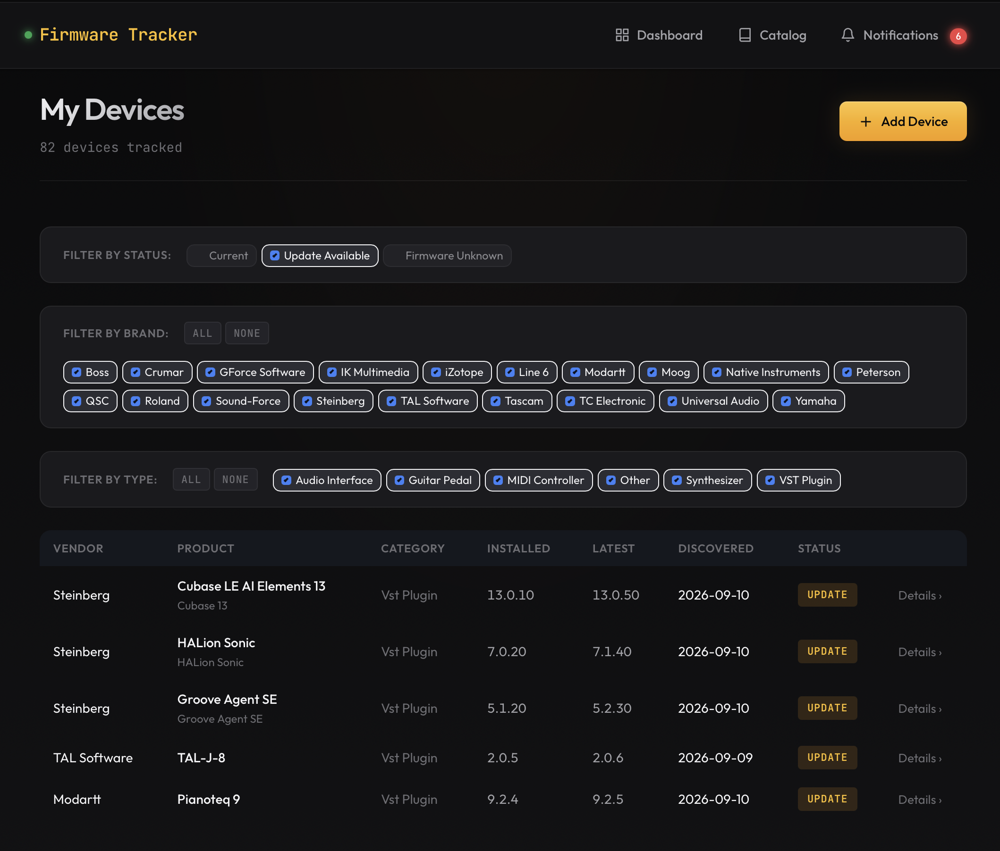
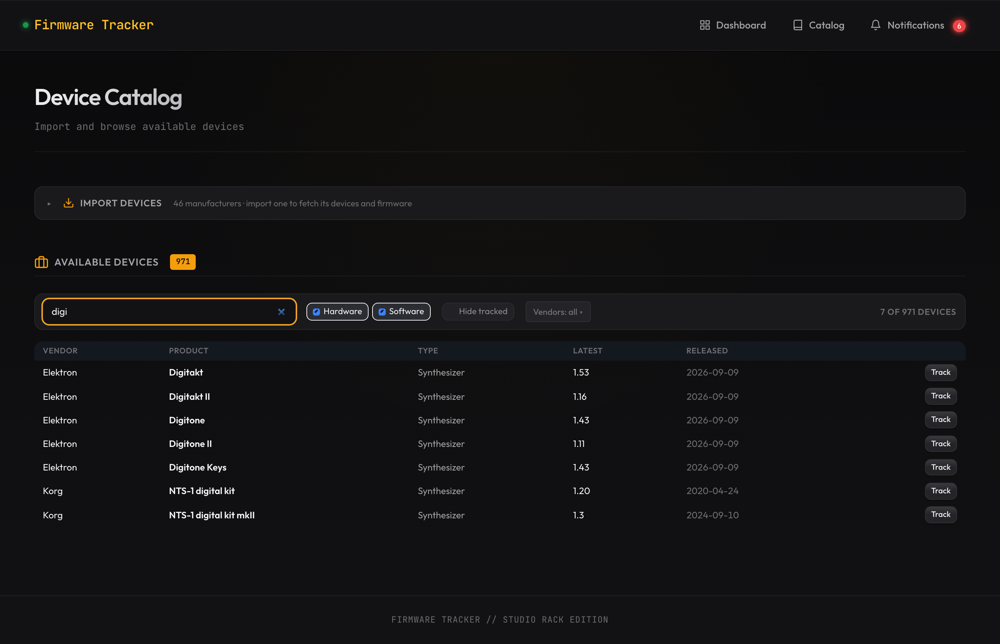

# Firmware Tracker

[](https://github.com/gmoynihan88/firmware_tracker/actions/workflows/ci.yml)

tl;dr, this is a web app that keeps inventory of sofware levels for your music gadgets.  The UI 
lets you add and update devices that are not online such as digital effects pedals, digital mixers,
loudspeakers, etc.  Software VSTs are simply queried on the filesystem.  

I wrote this because my QSC speaker had an update available that I overlooked for months, maybe 
a year or two, called bass amp mode.  HELL YEAH.  This is one of my favorite
software updates for anything, ever, and I almost missed it.  So, I wrote an app to discover
and notify me for all my stuff, because who has time to track that all the hard way?

DISCLAIMER:  Much of the text below was created by AI, skim appropriately, thanks! 

Music hardware and audio plugins get firmware and version updates that vendors rarely
announce. There is no feed to subscribe to and no common release channel — each
manufacturer has its own downloads page, and checking them by hand does not scale past
a few devices.

This scrapes 27 manufacturers on a schedule, compares what it finds against the gear
you own, and notifies you when something is behind.



*Filtered to devices with an update waiting. Sort any column; filter by status, brand or type.*

## Quick start

```bash
git clone https://github.com/gmoynihan88/firmware_tracker.git
cd firmware_tracker
docker compose up
```

Open http://localhost:8000. Nothing to configure — it starts with no notifications, no
AI summaries and no authentication, which is fine on localhost.

The plugin scanner runs standalone, without the server or database. On macOS it reads
the VST3, VST, AU and CLAP folders and reports every plugin with its version and vendor:

```bash
python scripts/scan_installed_plugins.py
```

<details>
<summary>Running it without Docker</summary>

Requires Python 3.11+.

```bash
pip install -e ".[dev]"
pip install -e ".[browser]" && playwright install chromium   # 10 scrapers need a browser
alembic upgrade head
uvicorn src.main:app --reload
```
</details>

## What it does

- **Scrapes 27 manufacturers** — Ableton, Arturia, Boss, Elektron, Eventide, Focusrite,
  iZotope, Korg, Moog, Native Instruments, Novation, Steinberg, Strymon, Universal Audio
  and more
- **Tracks hardware and plugins together**, rather than one or the other
- **Scans installed plugins** on macOS and matches them to the catalogue
- **Checks daily** and pushes to [ntfy](https://ntfy.sh) when something falls behind
- **Optional AI changelog summaries** via the Anthropic API

## Unknown versions are reported as unknown

Not every vendor publishes a version number, and a scraper that fills the gap with a
plausible guess is worse than one that reports nothing.

Universal Audio publishes no per-plugin versions: not on their site, not in their
release notes (which list changes by month with no version numbers), and their
installer manifest is encrypted. An earlier version of that scraper carried a
hardcoded table whose ten entries matched the plugins installed on the developer's
machine, because that is where they came from. It reported every product as current by
construction and could not detect an update. Those products now report no version,
which renders as "Firmware Unknown", and link to UA's release notes.

Eventide is a similar case for hardware. The H90 downloads page shows version 2.2.0,
which belongs to a companion app rather than the pedal; pedal firmware ships through
Eventide's device manager and is not published anywhere.

The reverse is worth stating, because assuming it cost this project 22 products. UA's
UAFX pedals are delivered by UA Connect too — their release notes open with "To update
your pedal's firmware, use UA Connect" — and are published in full, sixteen dated
versions back to 2021. Shipping firmware through a vendor's own installer says nothing
about whether the version is published.

A scrape distinguishes three outcomes rather than two: `devices_failed` is a fetch or
parse that broke, `devices_without_firmware` is a product the vendor publishes nothing
for, and `devices_not_checked` is the time budget running out. Collapsing the first two
would either hide a real breakage or report one every run.

**Products that will never report a version say so.** 95 of them publish nothing, and
for 62 a scraper has established why — the catalogue shows `not published` where the
vendor publishes no version anywhere, and `no firmware` where the product takes no
updates at all. The other 33 stay an em-dash, because nobody has checked and guessing
is the thing this avoids.

That split is what makes the absence list usable. `devices_without_firmware` carries
95 entries on every sweep, so a product that goes silent tomorrow joins a crowd nobody
reads; `devices_unexplained` holds only the ones with no recorded reason, and it is the
list that should be shrinking.

## Scraping load

Several of these vendors are very small operations, so the defaults are set to keep
request volume low.

- One request per second per manufacturer, and a daily check rather than hourly.
- Conditional requests (`If-None-Match` / `If-Modified-Since`), so an unchanged page
  returns `304` with no body. Five of the 27 vendors send validators; for those it
  saves the full page on every run.
- `SCRAPE_CACHE=1` serves repeat requests from disk during development. Working on a
  scraper means fetching the same page dozens of times, and a cached run is 35× faster
  as well as 35× less traffic.
- **Korg checks a fifth of its catalogue per run.** It is the one vendor with no
  listing covering more than a single product, and 164 product pages at ~4.8s each is
  794s against a 900s hard timeout — the first attempt was killed by it. Candidates
  are sorted and strided into five batches of 33, picked by day of year, so a run
  costs ~160s and every product is seen within five days. `KORG_FULL_SWEEP=1` does
  all five in one run, for a first import or a catch-up.

These are worth keeping if you fork it. Every instance scrapes independently, so the
load scales with the number of people running it.

## Alternatives

**[FW//RADAR](https://fwradar.com)** covers the same ground as a hosted service and is
the better option for hardware-only users: polished, with an iPhone app and used-market
prices that this has no equivalent for. It is closed-source, not self-hostable, and does
not read what is installed on your machine.

**[daw-plugin-manager](https://github.com/thelukehendy/daw-plugin-manager)** overlaps on
plugins. It refreshes a curated version catalogue; this scrapes each vendor directly. A
catalogue is less work to maintain but depends on someone updating it; scraping breaks
when a site changes but cannot silently fall behind.

**[pluginvault](https://github.com/GalAzu/pluginvault)** organises plugins rather than
versioning them. **[VST-Version-Scanner](https://github.com/BasShiFteR/VST-Version-Scanner)**
reports installed versions on Windows with nothing to compare them against.

This one is useful if you want the data self-hosted, want hardware and plugins tracked
together, or need a vendor the others do not cover.

## Usage

**Add devices** from the catalogue at `/catalog`. 715 devices across 27 vendors, so it
filters: type to narrow by product or vendor, untick a vendor, or hide what you already
track. Devices already tracked say so instead of offering to add a second copy.



Or add them in bulk:

```bash
python scripts/scan_installed_plugins.py --compare   # what matches the database
python scripts/scan_installed_plugins.py --add       # import the matches
```

**Run a scrape** by hand:

```bash
curl -X POST http://localhost:8000/api/firmware/scrape-all
curl -X POST http://localhost:8000/api/firmware/scrape/strymon
```

It reports what it could not do, not just what it did:

```json
{
  "new_firmware_versions": 195,
  "devices_without_firmware": ["Hall of Fame 2"],
  "devices_failed": [],
  "devices_not_checked": []
}
```

**Backfill notifications** for a device whose installed version you recorded *after* its
latest was already known — a scrape only notifies about versions it discovers, so those
would otherwise never fire. Safe to re-run; one notification per device per version:

```bash
curl -X POST http://localhost:8000/api/firmware/reconcile-notifications
```

**Get them on your phone** by setting a transport:

```bash
NOTIFY_TRANSPORT=ntfy
NTFY_TOPIC=firmware-tracker-<long random string>
```

Delivery is a side effect: if ntfy is unreachable the notification is still recorded and
the failure logged. The test suite forces the transport off, so `pytest` on a configured
machine cannot push fixture alerts to your phone.

**Find versions a vendor has withdrawn.** A version that disappears from a vendor's
page simply stops being returned, so without a last-seen stamp its row looks identical
to one confirmed this morning. Comparing it against the last successful scrape for
that vendor separates "withdrawn" from "we stopped looking":

```sql
WITH last_run AS (
  SELECT scraper_type, MAX(started_at) AS ran_at
  FROM scrape_runs WHERE success = 1 GROUP BY scraper_type
)
SELECT m.name, dm.name, fv.version, date(fv.last_seen_at)
FROM firmware_versions fv
JOIN device_models dm ON dm.id = fv.device_model_id
JOIN manufacturers m ON m.id = dm.manufacturer_id
JOIN last_run lr ON lr.scraper_type = m.slug
WHERE fv.last_seen_at < lr.ran_at;
```

**See what the scrapes have been doing**, which is what makes a quiet stretch in a
device's history readable — a version's first-seen date cannot tell "the vendor
published nothing for eight months" from "the scraper was broken for eight months":

```bash
curl "http://localhost:8000/api/firmware/runs?limit=20"
curl "http://localhost:8000/api/firmware/runs?scraper_type=yamaha"
```

**Back up the database** with `bash scripts/backup_db.sh` (`list` and `restore` too).
Each run writes two files: a `.db` that restores fastest and is byte-exact, and a
`.sql` text dump that diffs, compresses and can be read without sqlite. SQLite
rewrites pages on almost any change, so two binary snapshots a day apart share very
little — one scrape of a single manufacturer moved 3,238 bytes in the `.db` and five
lines in the dump.

`backups/` is gitignored, and should stay that way here: this database holds your
device list, and git history is permanent. If you want the dumps versioned, put them
in a private repo.

**Check referential integrity** with `python scripts/check_orphans.py` (`--fix` deletes
what it finds, exits 1 when there is anything). It should always find nothing: deletes
cascade through the ORM and SQLite is told to enforce foreign keys. It exists because
neither was true for most of this project's life, and a database outlives the bug that
damaged it.

## Security

**Authentication is off until you configure it**, which keeps a local install working
with no setup and is fine on localhost. Turn it on before this touches a public address:

```bash
python -m src.auth.hash_password
```

The app warns at startup while unconfigured. Without authentication every route is
open, including `POST /api/firmware/scrape-all` and full CRUD over the device list.
With auth on, only `/health`, `/login` and `/static` stay open: a load balancer cannot
present credentials, and requiring a session to reach the login form is a redirect loop.

Scripts can send `X-API-Key` instead, if `API_KEY` is set. Unset means the header is
ignored entirely, not that any key works. Passwords use scrypt, sessions use HMAC, both
from the standard library.

**On public ntfy.sh the topic name is the only secret.** Use a long random one
(`firmware-tracker-$(openssl rand -hex 16)`) and keep it in `.env`, which is gitignored.

## Health and logs

```bash
curl http://localhost:8000/health        # liveness  -> {"status":"ok","uptime_seconds":2.9}
curl http://localhost:8000/health/ready  # readiness -> {"status":"ok","database":"ok"}
```

`/health` touches nothing, so a failure means the process is wedged or gone. It
deliberately skips the database: if it checked, a slow disk would have the orchestrator
kill and replace tasks, which does not fix a slow disk. `/health/ready` runs a query and
returns **503** with a reason — on a deployment where the database is a file on a network
mount, losing that mount is exactly what this catches.

Logs go to stderr. Docker caps them at 10MB × 3; under systemd journald handles it; if
you run `uvicorn > file &` then nothing rotates it, so set `LOG_FILE` and the app rotates
for you. Access lines for `/health` are dropped by default — a container health check
polls it every 30 seconds, which is 95MB of log a year against about 1MB of actual
results.

## Configuration

Copy `.env.example` to `.env`. Everything has a working default; the ones you are most
likely to touch:

| Variable | Default | |
|---|---|---|
| `SCRAPE_INTERVAL_HOURS` | `24` | How often to check |
| `NOTIFY_TRANSPORT` | `none` | `ntfy` to push to your phone |
| `NTFY_TOPIC` | | Long and random — it is the only secret |
| `AUTH_PASSWORD_HASH` / `SECRET_KEY` | | Both required to enable auth |
| `ANTHROPIC_API_KEY` | | Enables changelog summaries |
| `SCRAPE_CACHE` | `false` | `true` while developing a scraper |
| `LOG_FILE` | | Set it if nothing else rotates your logs |

`.env.example` documents the rest, including cache TTLs, rate limiting and log levels.

## Supported manufacturers

| Hardware | Plugins |
|---|---|
| Arturia\* | Ableton (Live) |
| Boss | GForce Software |
| Crumar | IK Multimedia |
| Elektron | iZotope |
| Eventide\* | Modartt (Pianoteq) |
| Focusrite | Moog |
| Korg | Native Instruments |
| Line 6 | Steinberg |
| Novation | TAL Software |
| Peterson | Universal Audio |
| QSC |  |
| Roland |  |
| Sound-Force |  |
| Strymon |  |
| TC Electronic |  |
| Tascam |  |
| Yamaha |  |

\*Arturia and Eventide are on both sides: Arturia 116 instruments and effects
alongside 67 hardware products, Eventide 54 plugins and 29 pedals.

## Adding a scraper

Drop a file in `src/scrapers/plugins/`. It is auto-discovered on startup.

```python
from src.scrapers.base import BaseScraper, ScrapedDevice, ScrapedFirmware, ScraperResult

class MyScraper(BaseScraper):
    manufacturer_name = "Acme Audio"
    manufacturer_slug = "acme"
    manufacturer_website = "https://acme.example.com"

    async def fetch_device_list(self) -> ScraperResult:
        ...

    async def fetch_firmware_versions(self, device_name, firmware_page_url) -> ScraperResult:
        ...
```

Return `success=False` when a fetch or parse breaks, and `success=True` with an empty
list when the page loaded and the product genuinely has none. Add the slug to
`tests/test_basic.py::test_api_scrapers`.

The repo carries two [Claude Code skills](.claude/skills/): one for writing a scraper,
one for diagnosing a broken one. The diagnostic steps are drawn from the scrapers that
actually broke here; in nearly every case the cause was a dead URL or a relocated data
source rather than a parsing error.

## Development

```bash
pytest                                   # 260 tests
pytest --cov=src                         # 79% overall, 83% outside the scrapers
pytest tests/test_basic.py::test_dashboard

coverage report --omit='src/scrapers/plugins/*' --fail-under=80   # the gates CI runs
coverage report --fail-under=65
```

Tests use in-memory SQLite and never touch the real database.

CI enforces two coverage thresholds: 80% for application code and 65% for the whole
project. The second is deliberately looser. Scrapers are verified against the live
vendor site rather than by coverage, and each new one arrives with mostly-uncovered
lines, costing roughly a point of the total.

`concurrency = ["greenlet", "thread"]` in `pyproject.toml` is required for those
numbers to be accurate. SQLAlchemy bridges async to the sync DBAPI through greenlets,
and without it coverage stops tracing at each handler's first `await` into the
database, which understated the API and web layers by roughly 35 points.

<details>
<summary>Project layout</summary>

```
src/
  main.py              # FastAPI app, lifespan, router registration
  config.py            # Settings from .env
  database.py          # Async engine, session factory, integrity repair
  logging_config.py    # Handler, rotation, health-check access filter
  templating.py        # Jinja env with content-hashed asset URLs
  devices/             # Models, schemas, CRUD service, REST router
  web/                 # HTML page routes
  auth/                # scrypt hashing, HMAC sessions, middleware
  health/              # Liveness and readiness
  firmware/            # Scrape trigger endpoints
  scrapers/
    base.py            # aiohttp + Playwright helpers
    registry.py        # Auto-discovery via pkgutil
    service.py         # Orchestrates scrape -> sync -> notify
    cache.py           # Dev cache and ETag revalidation
    plugins/           # One file per manufacturer (27 scrapers)
  notifications/       # ntfy transport, and reconciliation
  scheduler/           # APScheduler periodic checks
  summarizer/          # Optional Claude changelog summaries
alembic/               # Migrations; env.py prefers DATABASE_URL
Dockerfile             # python:3.12-slim + Chromium, runs as uid 10001
docker-compose.yml     # Volumes, log caps
```
</details>

## Known limits

- The **plugin scanner is macOS only**. Windows plugins are DLLs with no `Info.plist`,
  so versions would need a completely different mechanism.
- Scrapers send a **browser User-Agent**, because some vendors reject anything else. The
  trade-off is that a vendor cannot tell who is calling or ask you to stop.
- The web app itself runs anywhere on Python 3.11+. Linux is CI-verified across 3.11,
  3.12 and 3.13; macOS is the development platform; Windows is untested.
- **Release dates are missing for about a sixth of current versions** — 416 of 507 have
  one. That is what the vendor publishes, not what the scraper managed to read: some
  list a version with no date anywhere on the page. The catalogue shows an em-dash
  rather than substituting the date the version was first seen, which would read as a
  release date and would be wrong.

## License

MIT
